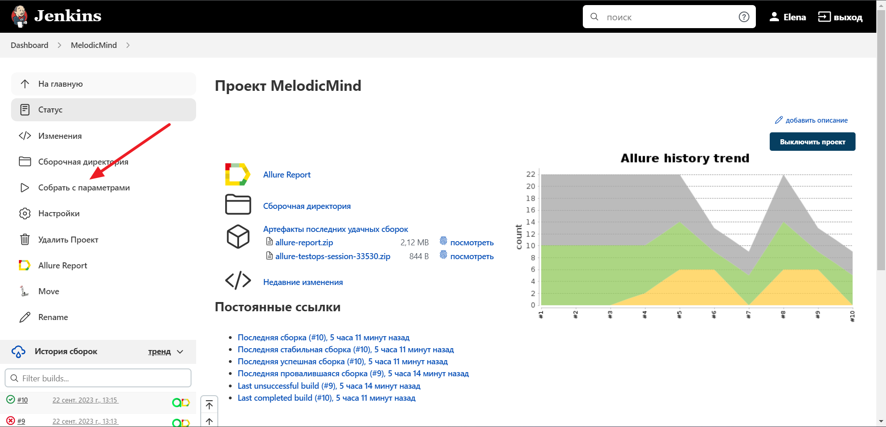
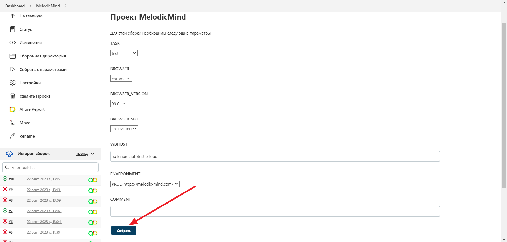
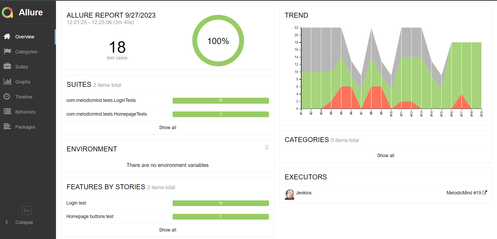
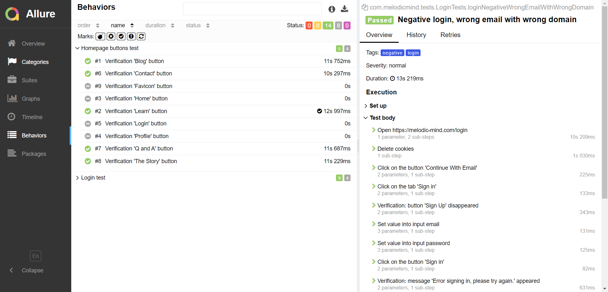
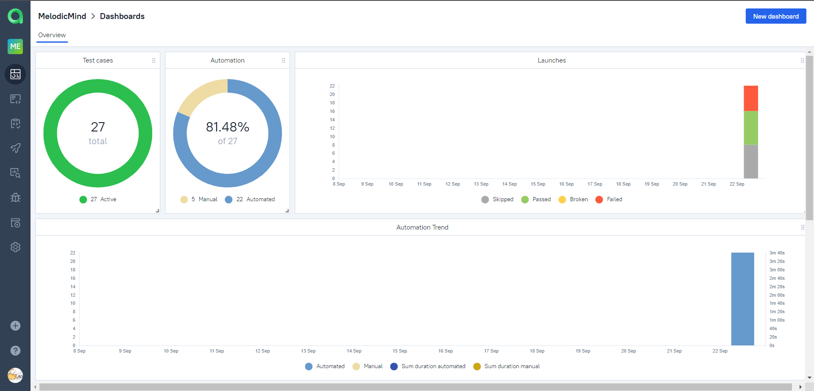
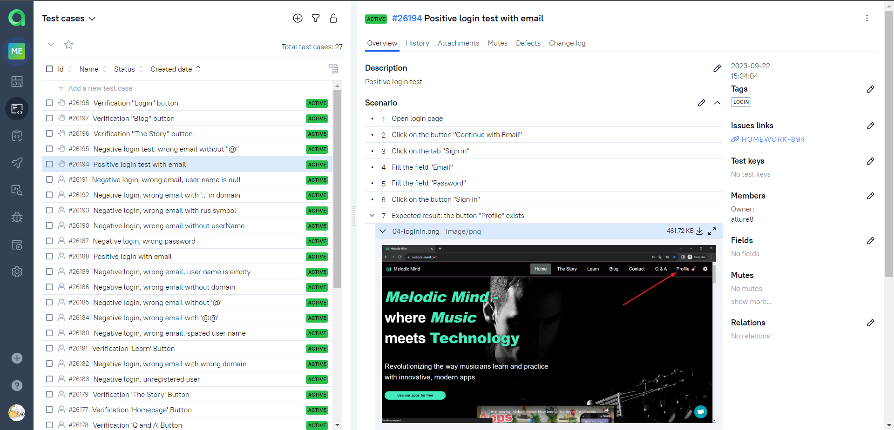
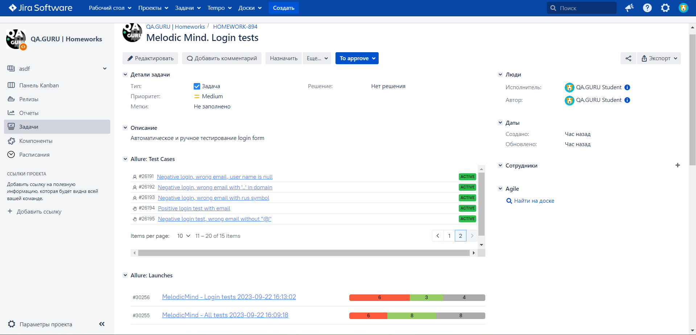
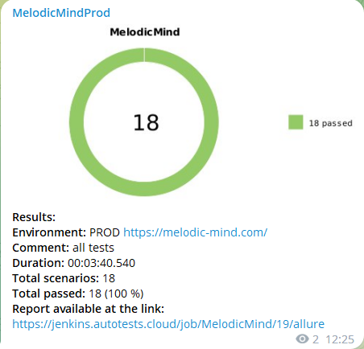
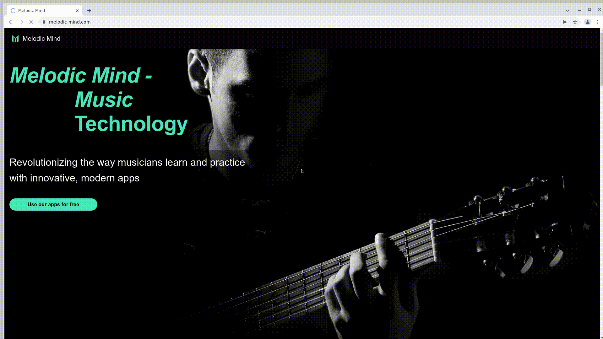
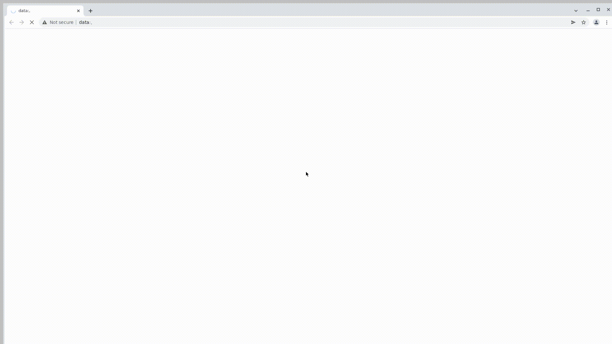

# Проект по автоматизации тестирования для сайта Melodic Mind
 > Революция в способах обучения и практики музыкантов с помощью инновационных современных приложений.  

[Melodic Mind](https://melodic-mind.com/) - where Music meets Technology.  

### Содержание
[Технологии и инструменты](#Технологии-и-инструменты)  
[Сборка в Jenkins](#Сборка-в-Jenkins)  
[Allure Report](#Allure-Report)  
[Интеграция с Allure TestOps](#Интеграция-с-Allure-TestOps)  
[Интеграция с Jira](#Интеграция-с-Jira)  
[Уведомление в Telegram](#Уведомление-в-Telegram)  
[Примеры видео выполнения тестов на Selenoid](#Примеры-видео-выполнения-тестов-на-Selenoid)  

### Технологии и инструменты

Автотесты написаны на языке `Java` с использованием `JUnit 5`, `Selenide`. Запуск браузера осуществляется в `Selenoid`.
Сборщик проекта - `Gradle`. Для удаленного запуска реализована задача в `Jenkins` с формированием `Allure-отчета` и
отправкой результатов в `Telegram` при помощи бота. Так же осуществлена интеграция с `Allure TestOps` и `Jira`.
  

### Сборка в Jenkins

#### Параметры сборки:

- **WBHOST** - URL Selenoid (по умолчанию selenoid.autotests.cloud)
- **TASK** - задачи (по умолчанию test)
- **BROWSER** - браузер (по умолчанию chrome)
- **BROWSER_VERSION** - версия браузера (по умолчанию 99.0)
- **BROWSER_SIZE** - размер окна браузера (по умолчанию 1920x1080)

Для запуска сборки необходимо перейти в раздел `Собрать с параметрами`, выбрать необходимые параметры и нажать
кнопку `Собрать`.

### Allure Report

##### Overview

##### Test details

### Интеграция с Allure TestOps

В отчете `Allure TestOps` можно:

- просматривать созданные тест-кейсы и чек-листы,
- запускать ручные и автоматические тестовые прогоны,
- заводить дефекты,
- собирать статистику о проделанной работе.

##### Allure TestOps Dashboard

##### Ручные и автоматические тест-кейсы

### Интеграция с Jira

Интеграция `Allure TestOps` с `Jira`, позволяет отображать в задаче, открытой в `Jira`, какие тест-кейсы были написаны в
рамках задачи и результат их выполнения.

### Уведомление в Telegram

После завершения сборки, автоматически отправляется отчет о результатах выполнения тестов в специально созданный `Telegram канал`.

### Примеры видео выполнения тестов на Selenoid

В отчетах Allure для каждого теста создается не только скриншот, но и видео его прохождения.

  

