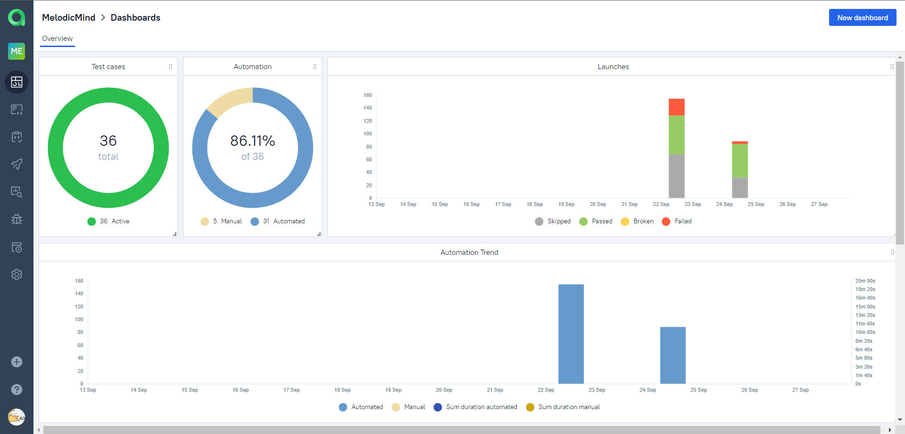

# Проект по автоматизации тестирования для сайта Melodic Mind

Melodic Mind - where Music meets Technology

### Содержание
[Технологии и инструменты](#Технологии-и-инструменты)

Автотесты написаны на языке `Java` с использованием `JUnit 5`, `Selenide`. Запуск браузера осуществляется в `Selenoid`.
Сборщик проекта -  `Gradle`. Для удаленного запуска реализована джоба в Jenkins с формированием Allure-отчета и
отправкой результатов в Telegram при помощи бота. Так же осуществлена интеграция с `Allure TestOps` и `Jira`.

### Технологии и инструменты

### Команды для запуска из терминала

Запуск всех тестов:
`gradle clean test -Dselenoid_url="selenoid.autotests.cloud/wd/hub" -Dbrowser_size="1920х1080" -Dbrowser="chrome" -Dbrowser_version="100.0"`
Запуск `homepage tests`:
`gradle clean homepage -Dselenoid_url="selenoid.autotests.cloud/wd/hub" -Dbrowser_size="1920х1080" -Dbrowser="chrome" -Dbrowser_version="100.0"`
Запуск `login tests`:
`gradle clean login -Dselenoid_url="selenoid.autotests.cloud/wd/hub" -Dbrowser_size="1920х1080" -Dbrowser="chrome" -Dbrowser_version="100.0"`

При выполнении команды, данные тесты запустятся удаленно в Selenoid.

###  Сборка в Jenkins

#### Параметры сборки

- *WBHOST* (URL Selenoid, по умолчанию selenoid.autotests.cloud)
- *TASK* (Задачи, по умолчанию test)
- *BROWSER* (Браузер, по умолчанию chrome)
- *BROWSER_VERSION* (Версия браузера, по умолчанию 99.0)
- *BROWSER_SIZE* (Размер окна браузера, по умолчанию 1920x1080)

Для запуска сборки необходимо перейти в раздел `Собрать с параметрами`, выбрать необходимые параметры и нажать
кнопку `Собрать`.

###  Allure Report

##### Overview

##### Test details

### Интеграция с Allure TestOps

В отчете `Allure TestOps` можно:

- просматривать созданные тест-кейсы и чек-листы,
- запускать ручные и автоматические тестовые прогоны,
- заводить дефекты,
- собирать статистику о проделанной работе.

##### Allure TestOps Dashboard

##### Автоматические и ручные тест-кейсы

### Интеграция с Jira

Интеграция `Allure TestOps` с `Jira`, позволяет отображать в тикете, открытом в `Jira`, какие тест-кейсы были написаны в
рамках задачи и результат их прогона.

### Уведомление в Telegram

После завершения сборки, автоматически отправляется отчет о результатах прогона тестов в `Telegram канал`.  

### Примеры видео выполнения тестов на Selenoid

В отчетах Allure для каждого теста создается не только скриншот, но и видео его прохождения.

